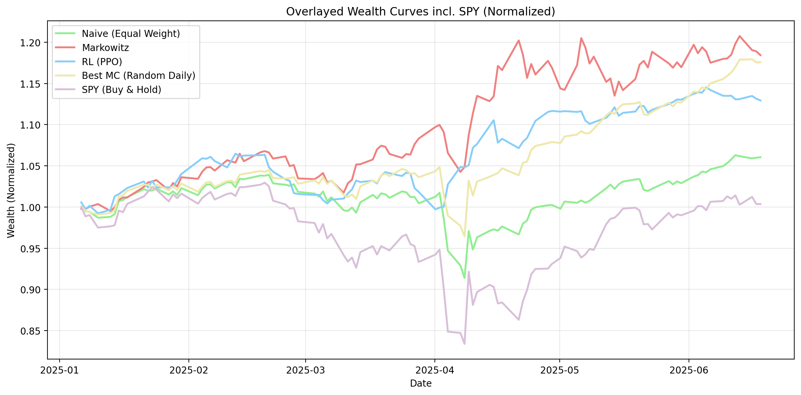

# DRL Portfolio Optimization

An applied PPO portfolio allocator for 10 liquid ETFs.

The agent sees recent returns, technical features, realized volatility, correlation, calendar features, and
its previous weights. It outputs a long-only allocation. The test period is 2025 H1.

This is an empirical project, not a theorem. The useful result is that the RL policy produced a smoother,
lower-volatility portfolio than rolling Markowitz on the held-out window, which lifted Sharpe despite lower
raw return.

## Results

| Portfolio | Sharpe | Ann. Excess Return | Volatility | Max Drawdown | CAGR |
|---|---:|---:|---:|---:|---:|
| **RL (PPO)** | **2.00** | 24.63% | 12.31% | -6.35% | 32.13% |
| Rolling Markowitz | 1.75 | 31.68% | 18.06% | -5.80% | 40.56% |
| Equal weight | 0.82 | 12.67% | 15.44% | -12.05% | 16.48% |
| SPY buy-and-hold | 0.06 | 1.49% | 26.48% | -19.00% | 0.78% |



## What Happened

The RL policy took less volatility than Markowitz. It gave up some excess return, but the volatility reduction
was larger, so Sharpe improved from **1.75** to **2.00**.

The policy also changed concentration over time. It concentrated when the signal looked cleaner and diversified
when the feature state looked weaker. That behavior is useful because rolling mean-variance optimization can
lean too hard on noisy means and covariances.

Monte Carlo random-allocation checks put the Markowitz Sharpe near the top **0.3%** of simulated paths and the
RL Sharpe near the top **0.01%**. Treat that as context, not proof of a permanent edge.

## Setup

- **Universe:** `SPY QQQ IWM EFA EEM VNQ TLT IEF GLD USO`
- **Train:** 2019-01-01 to 2024-05-31
- **Validation:** 2024-06-01 to 2024-12-31
- **Test:** 2025-01-02 to 2025-07-01
- **Data:** Polygon.io daily OHLCV plus technical indicators

## Model

| Component | Detail |
|---|---|
| Algorithm | PPO with Stable-Baselines3 and state-dependent exploration |
| State | 274 features: return windows, indicators, realized vol, downside vol, ranks, correlation, time features, previous weights |
| Action | Continuous logits mapped through softmax into portfolio weights |
| Reward | Excess return minus turnover cost and risk penalties |
| Refit | Monthly fine-tune on the most recent 90-day window during test |

## Baselines

- **Rolling Markowitz:** mean-variance optimization with a 6-month rolling window.
- **Equal weight:** static 10% per ETF.
- **SPY:** buy-and-hold market proxy.

## Repo Map

```text
data/          data loading and feature engineering
rl_ppo/        PPO environment, policy, training, evaluation
markowitz/     rolling Markowitz baseline
naive/         equal-weight baseline
analysis/      plots, Monte Carlo checks, feature analysis
```

## Quickstart

```bash
pip install -r requirements.txt
make train
make eval
```

Hyperparameters live in `rl_ppo/config.py`. Monthly-refit overrides live in `rl_ppo/refit_config.py`.
